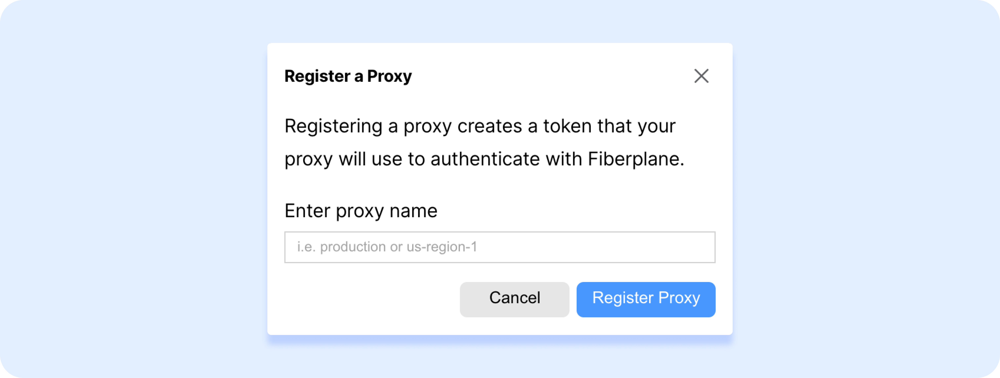

<div align="center">
  
  <br>
  <div align="center">
    <a href="https://twitter.com/fiberplane">
      
    </a>
  </div>

<br>

  <h1>Getting started with Fiberplane</h1>

</div>

Fiberplane Studio is available for the [Web](https://fiberplane.com/) (macOS and Linux desktop applications coming soon).

To get started go to [https://fiberplane.com/](https://fiberplane.com/) and log in with your Fiberplane account (currently available only for Google with Workspace users). You can also go right away to your notebook by typing [fp.new](https://fp.new) in your URL, however, to save and store your notebook, you will need to log in.

# Set up Fiberplane

Get started using Fiberplane Proxy and Fiberplane Studio to monitor, analyze your infrastructure and collaborate with others.

- [Set up the proxy](#set-up-the-proxy)
	- [Deploy the proxy to your Kubernetes cluster (recommended)](#deploy-the-proxy-to-your-kubernetes-cluster-%28recommended%29)
	- [Run the proxy locally (optional)](#run-the-proxy-locally-%29optional%29)

# Set up the proxy

The Fiberplane Proxy enables you to connect the Fiberplane Studio to data sources in your cluster(s) securely without exposing them to the Internet.


## Register the proxy with Fiberplane

Create a proxy API token to authenticate the Proxy with Fiberplane's services:

1. Go to your Fiberplane [Settings page](https://fiberplane.com/settings).
2. Click **`+ New Proxy`** to register a proxy with a name that identifies the cluster you will install it into (for example, "Production"). This will generate and display a Proxy API Token that the proxy will use to authenticate with the Fiberplane Studio.
3. Copy the Proxy API Token generated in Step 2 for the next step.

You can now deploy the Proxy to your cluster or run it locally for testing.

### Deploy the proxy to your Kubernetes cluster (recommended)

1. Create the Kubernetes configuration file and change the Prometheus URL to point to the Prometheus instance(s) inside your cluster. See example file in `proxy-kubernetes/configmap.yaml`
2. Create the Kubernetes deployment file (replace `<token>` with the Proxy API token created during the proxy registration step). See example file in `proxy-kubernetes/deployment.yaml`
3. Apply the changes to your Kubernetes cluster by running the following commands:

```shell
kubectl apply -f configmap.yml
kubectl apply -f deployment.yml
```

### Run the proxy locally (optional)

Note: this option is only recommended for testing purposes. If you intend to run the Proxy in production, it is strongly recommended to install it in your production cluster (see instructions above).

1. Make sure you have [Docker](https://docs.docker.com/get-docker/) installed.
2. Create a `data_sources.yaml` in the root directory. Use the template provided at `proxy-local/data_sources.yaml`
3. Run the following command replacing `<proxy_api_token>` with the Proxy API Token created earlier:
	```shell
	docker run \
	  -v "$PWD/data_sources.yaml:/app/data_sources.yaml" \
	  fiberplane/proxy:v1.1.2 \
	  --auth-token=<proxy_api_token>`
	```

Once you complete your Proxy setup, your data sources linked in the Proxy configuration should be recognized by the Studio - you can verify this again by going to the **Settings** screen.👇


