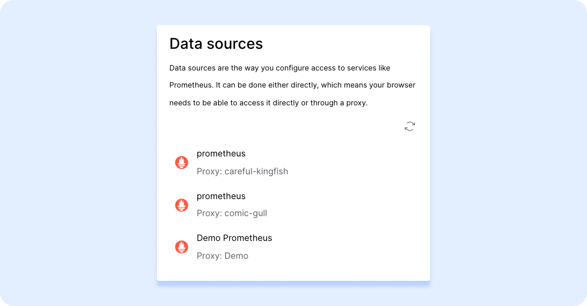

<div align="center">
  
  <hr style="border-width: 0.25em"></hr>
</div>

Fiberplane is a collaborative notebook that connects to your observability stack and helps you monitor and debug your infrastructure. Fiberplane is currently available for the Web in closed beta - you can sign up for early access 👉 **[here](https://fiberplane.dev)**.

You can explore a Fiberplane Notebook by simply going to [fp.new](https://fp.new) in the address bar of your browser, however, in order to save your notebook or query your observability data you will need to create an account and establish access to your infrastructure.

### How Fiberplane works

Fiberplane accesses your infrastructure through Proxy, a lightweight package, [available as a Docker image](https://hub.docker.com/r/fiberplane/proxy), that once installed allows you to query your observability data from your Notebook.

Whenever you execute a query in the notebook:

1. The query is forwarded to the Fiberplane Proxy in your cluster;
2. The Proxy then queries the data source (e.g. your Prometheus or Elastic instance);
3. The Proxy processes, encrypts, and then returns the data back to the Studio.

\***Note:**\* Fiberplane Proxy is currently optimized to work with Kubernetes and Prometheus. Elasticsearch, Loki and more providers are coming soon.

## ⚡️ Setting up the Fiberplane Proxy with the CLI

This guide will walk you through how to set up the Fiberplane Proxy and install it in your Kubernetes cluster or run it locally for testing purposes.

#### What is in this repo?

<table>
<tr>
    <td>proxy-kubernetes/</td>
    <td>Sample YAML files to configure and deploy the Fiberplane Proxy to your Kubernetes cluster </td>
</tr>
<tr>
    <td>proxy-local/</td>
    <td>Sample YAML configuration to deploy the Fiberplane Proxy locally</td>
</tr>
</table>

### Step 1: Download the Fiberplane CLI (beta)

You can download and install the Fiberplane CLI `fp` with one command:

```shell
curl --proto '=https' --tlsv1.2 -sSf https://fp.dev/install.sh | sh
```

<details>
<summary>Alternatively: Download the latest binaries directly with cURL (click to expand)</summary>

#### Download the latest `fp` binary release with cURL using one of the options below:

##### Mac (Apple Silicon):

```shell
curl -O https://fp.dev/fp/latest/aarch64-apple-darwin/fp
```

##### Mac (Intel):

```shell
curl -O https://fp.dev/fp/latest/x86_64-apple-darwin/fp
```

##### Linux / Windows (WSL):

```shell
curl -O https://fp.dev/fp/latest/x86_64-unknown-linux-gnu/fp
```

#### Make the `fp` binary executable:

```shell
chmod 700 ./fp
```

</details>

### Step 2: Authenticate the CLI

You will need to authenticate the downloaded CLI with your Fiberplane account so you can create and register the Proxies. Simply type:

```shell
fp login
```

You will be then prompted to login with your account. When you complete the login you can safely close the window.

You can now access your Fiberplane Notebooks through the CLI (see reference for some of the basic available commands)!

<!-- TODO: add a CLI reference link -->

### Step 3: Register a Proxy with Fiberplane

In order for the Proxy to receive queries from Fiberplane Notebooks, it needs to be authorized. This step will generate a **Proxy API Token** that will be needed in later steps.

To register a proxy run a command `fp proxy add`:

```
$ fp proxy add
Added proxy "robust-antelope" # generates a random name
Proxy API Token: XXX_XX # and a token - save this for later!
```

### Step 4: Deploy the Proxy to your Kubernetes cluster

1. Clone this repository and grab the example configuration files from `proxy-kubernetes/` folder.
2. In the `configmap.yaml` set the name, type, and the URL of the data sources (you can use the existing template).
3. In the `deployment.yaml` add the Proxy API Token generated earlier.
4. Place both `configmap.yaml` and `deployment.yaml` at the root of your project directory.
5. Apply the changes to your Kubernetes cluster by running the following commands:

```shell
kubectl apply -f configmap.yml
kubectl apply -f deployment.yml
```

6. Kubernetes will automatically download, install, and configure the Fiberplane Proxy container from the [Docker Hub](https://hub.docker.com/r/fiberplane/proxy).

Once you complete your Proxy setup, your data sources linked in the Proxy configuration should be recognized by the Studio - you can verify this again by going to the **Settings** screen.👇



### Step 4b: Run the proxy locally for testing

**Note:** this option is only recommended for testing purposes. If you intend to run the Proxy in production, it is strongly recommended to install it in your production cluster (see instructions above).

1. Make sure you have [Docker](https://docs.docker.com/get-docker/) installed.
2. Copy the `data_sources.yaml` example file and place it in the project root directory.
3. Run the following command replacing `{PROXY_API_TOKEN}` with the API token generated earlier:

```shell
docker run \
  -v "$PWD/data_sources.yaml:/app/data_sources.yaml" \
  fiberplane/proxy:v1 \
  --auth-token={PROXY_API_TOKEN}`
```

## Feedback and support

We're always looking to improve our onboarding experience! Please report any issues and share your feedback by either:

-   messaging us on Slack, we're active there (email [support@fiberplane.com](mailto:support@fiberplane.com) for an invite);
-   emailing us at [support@fiberplane.com](mailto:support@fiberplane.com).
