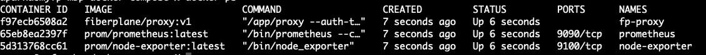
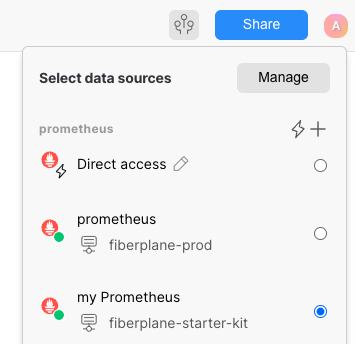
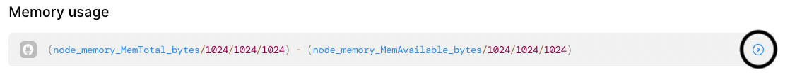

# Fiberplane Starter-Kits :rocket:

Fiberplane starter-kits aim to help you get an experience of how Fiberplane can be used within your infrastructure to ease troubleshooting incidents. This starter kit uses docker to run the following as docker containers:
- [prometheus](https://prometheus.io/)
- [prometheus node exporter](https://prometheus.io/docs/guides/node-exporter/)
- [fiberplane proxy](https://docs.fiberplane.com/quickstart)

## Pre-Requisites
:white_check_mark: **[docker](https://docs.docker.com/get-docker/) and [docker-compose](https://docs.docker.com/compose/install/)** - Installed and running. These are used to run containers locally.\
:white_check_mark: **[Fiberplane CLI](https://docs.fiberplane.com/quickstart/set-up-the-fiberplane-proxy-with-the-cli#3b87d09b5321477cb6268caed0b5f9ae)** - Enables you to create & manage templates, notebooks, proxy API keys and more via cli.\
:white_check_mark:  **Proxy API token** - Can be created either on [Fiberplabe Studio (UI)](https://docs.fiberplane.com/quickstart/set-up-the-fiberplane-proxy#cae32ee6460b490a98aa0ecf7fd82a71) or via [CLI](https://docs.fiberplane.com/quickstart/set-up-the-fiberplane-proxy-with-the-cli#5bcaeea073a043f3a384d3f35640ca1e).

We recommend method 1, however, if you prefer bash script you could use method 2. The end result is the same.

It's possible to replace docker with [podman](https://podman.io/) when using our starter kits. If you wish to do so, we recommend installing [podman-compose](https://github.com/containers/podman-compose) and replacing all `docker-compose` commands with `podman-compose`. All other aspects remain the same. 

## Method 1 - docker-compose
- `git clone [repolink](linkhere.com)`
- `cd starter-kits/prometheus/docker-compose`
- Edit the .env file (`vi .env`) and add in the proxy API token generated in step 2 of the [Pre-Requisites](_point.to.pre-req_). eg : `TOKEN=yourtokenhere`
- `docker-compose up -d`

## Method 2 - bash script
- Download the package relevant for your CPU architecture `curl -LO _insert the url here_`
- Run the script (`./fp-starterkit-prom.sh`)
- Follow the prompts.

## Verifying the installation
Verify that the containers are running (run `docker ps`). 

Here is a sample output of what you should see after following either method 1 or 2

If you used method 2, you will also have `data_sources.yaml`, `docker-compose.yml`, `prometheus.yml` created in the current directory, very similar to the sample-* files in the [repo](linkhere.com)

## Exploring the data on Fiberplane
Now that you have everything setup, you are ready to create your first notebook. We recommend following the instructions below to do so using our starter kit template.

1. Get the template
    - If method 1 was used - `cd ../` (prometheus directory)
    - If method 2 was used - `curl -LO  https://addtheactuallinktotemplatehere.jsonnet`
2. Add the template jsonnet file to Fiberplane: `fp templates create --title="My first template" fp-prom-starter-template.jsonnet` >> Make a note of the template id.
3. Now you can create a notebook using the template you just created. On Fiberplane studio, click on templates >> your template >> New notebook >> Create Notebook. This is also doable using CLI, just make sure you have the template id from step 2 - `fp templates expand <templateid>`
4. Click the notebook link and you will have a notebook with few prometheus queries pre-populated. Select your datasource `my Prometheus`\
    
5. Now execute each query by hitting CTRL + ↩︎ (Mac: ⌘ + ↩︎) or by clicking the play button next to each query cell.

The full documentation for using notebooks and templates can be found on our [documentation site](https://docs.fiberplane.com)
